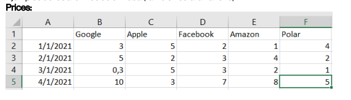
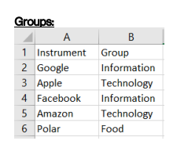

# Group Analyzer API

------

Group Analyzer API (GAAPI) it's a API that calculate the mean of a group of assets

This project was made in python and use FastApi for the API and Pandas to manage the data

This project was part of interview process and also my first experience using FastApi.

# Input

-----

The endpoint receive two .csv files the first one is a $$m*n$$ matrix where $$n$$ is the number of dates and m number of assets and the value it's a float which describe the price of that asset 



and the second is the group matrix, these groups will come in a key/value format, where the key will be the asset and the value the group to which it belongs. 



# Install and Run

----

1. Create the virtual enviroment 

   ```sh
   virtualenv venv --python=3
   ```

2. Activate virtual venv 

   ```sh
   source venv/bin/activate
   ```

3. Install fastapi 

    

   ```sh
   pip install fastapi uvicorn
   ```

   

4. Install pandas

   ```sh
   pip install pandas
   ```

   

5. Start the server 

   ```sh
   uvicorn main:app --reload
   ```

   

6. Got to http://127.0.0.1:8000/docs 

   

   

7. 

   

   

